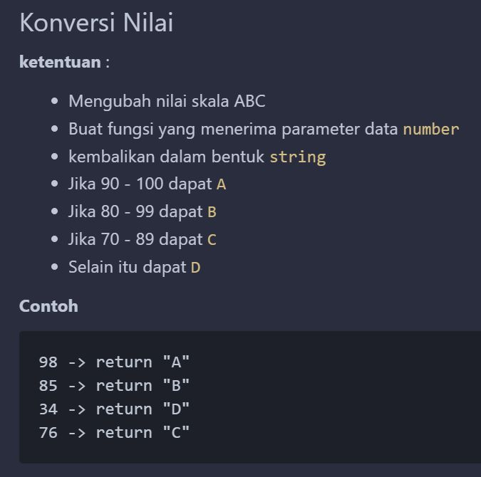

# Latihan Array Javacript
---

`Array` adalah suatu jenis variabel yang digunakan untuk menyimpan kumpulan data dalam 1 tempat dengan terorganisir dan terstruktur serta dapat berisi banyak tipe data seperti `number`, `string`, `boolean`, `object`, bahkan `array` lain meskipun cukup jarang. 

Dalam mengidentifikasi elemen didalam suatu array, diperlukannya untuk mengetahui `nomor indeks` yang dimulai dari `0` untuk `elemen pertama` dan nomor berikutnya untuk elemen berikutnya. Tidak hanya mengidentifikasi, `nomor indeks` juga diperlukan saat memanipulasi elemen array seperti menambahkan, mengubah, atau bahkan menghapus elemen dari array tersebut.

---

## Link Soal
[Link Soal Latihan](https://github.com/auzanassdq/latihan-logic/blob/main/01-array/1-array.md)

---

## Project Tree
- 📂 [__LatihanArrayJS__](LatihanArrayJS)
   - 📂 [__4 April__](4_April)
     - 📄 [nilai.js](4_April/nilai.js)
     - 📄 [tambahsoal.js](4_April/tambahsoal.js)
   - 📂 [__6_April__](6_April)
     - 📂 [__classicway__](6_April/classicway)
       - 📄 [get2d.js](6_April/classic_way/get2d.js)
       - 📄 [kelipatan.js](6_April/classic_way/kelipatan.js)
       - 📄 [linear.js](6_April/classic_way/linear.js)
       - 📄 [maxmin.js](6_April/classic_way/maxmin.js)
       - 📄 [mmarray.js](6_April/classic_way/mmarray.js)
       - 📄 [palindrome.js](6_April/classic_way/palindrome.js)
       - 📄 [reversearray.js](6_April/classic_way/reversearray.js)
       - 📄 [sum2d.js](6_April/classic_way/sum2d.js)
       - 📄 [sumarray.js](6_April/classic_way/sumarray.js)
     - 📂 [__nonclassic way__](6_April/nonclassicway)
       - 📄 [get2d.js](6_April/nonclassic_way/get2d.js)
       - 📄 [kelipatan.js](6_April/nonclassic_way/kelipatan.js)
       - 📄 [linear.js](6_April/nonclassic_way/linear.js)
       - 📄 [maxmin.js](6_April/nonclassic_way/maxmin.js)
       - 📄 [mmarray.js](6_April/nonclassic_way/mmarray.js)
       - 📄 [palindrome.js](6_April/nonclassic_way/palindrome.js)
       - 📄 [reversearray.js](6_April/nonclassic_way/reversearray.js)
       - 📄 [sum2d.js](6_April/nonclassic_way/sum2d.js)
       - 📄 [sumarray.js](6_April/nonclassic_way/sumarray.js)
   - 📂 [__img__](img)
     - 📄 [tugas.jpg](img/tugas.jpg)
   - 📄 [readme.md](readme.md)
---

## Table Of Content
- [Latihan Array Javacript](#latihan-array-javacript)
  - [Link Soal](#link-soal)
  - [Project Tree](#project-tree)
  - [Table Of Content](#table-of-content)
  - [Penjelasan Jawaban](#penjelasan-jawaban)
    - [Soal 1 : Konversi Nilai](#soal-1--konversi-nilai)
    - [Soal 2 : Total Nilai Elemen pada Array](#soal-2--total-nilai-elemen-pada-array)
    - [Soal 3 : Reverse Array](#soal-3--reverse-array)
    - [Soal 4 : Linear Search](#soal-4--linear-search)
    - [Soal 5 : Fizz Buzz Array](#soal-5--fizz-buzz-array)
    - [Soal 6 : Get 3\&5 Number](#soal-6--get-35-number)
    - [Soal 7 : Palindrome](#soal-7--palindrome)
    - [Soal 8 : Max and Min](#soal-8--max-and-min)
    - [Soal 9 : Get 2D array](#soal-9--get-2d-array)
    - [Soal 10 : Sum 2D array](#soal-10--sum-2d-array)
    - [Soal 11 : Max Min 2D array](#soal-11--max-min-2d-array)

---

## Penjelasan Jawaban
### Soal 1 : Konversi Nilai



Dalam pengerjaannya, saya membuat sebuah fungsi yang diberi nama `konversiNilai()` yang menerima input berupa nilai. Fungsi ini bertujuan untuk mengkonversi sebuah nilai numerik ke dalam bentuk huruf, yang merepresentasikan rentang nilai tertentu.

Hal pertama yang perlu diperiksa agar tidak terjadi kesalahan saat dijalankan adalah apakah input yang diterima berupa angka atau tidak. Caranya adalah dengan menggunakan method `isNaN()` pada suatu kondisi `if`, sehingga hanya angka yang masuk dalam perulangan tersebut dan tidak menghasilkan output berupa `undefined` saat dijalankan.

Setelah pengecekan input, langkah berikutnya adalah memeriksa apakah nilai input berada dalam rentang angka antara 0-100, karena fungsi ini hanya akan mengkonversi nilai numerik dalam rentang ini ke dalam bentuk huruf berdasarkan range tertentu, sesuai dengan yang telah dijelaskan dalam soal.

Jika nilai input berada di antara 90-100, fungsi akan mengembalikan nilai `A`, jika nilai input berada di antara 80-89, fungsi akan mengembalikan nilai `B`, jika nilai input berada di antara 70-79, fungsi akan mengembalikan nilai `C`, dan jika nilai input berada di bawah 70, fungsi akan mengembalikan nilai `D`.

Sebagai tindakan pencegahan, jika nilai input berada di luar rentang 0-100, fungsi akan mengembalikan output berupa `Input harus berada di antara 0-100!`.

Berdasarkan penjelasan di atas, kode dapat ditulis seperti berikut: 

```javascript
// fungsi untuk melakukan konversi nilai
function konversiNilai(nilai) {
  if (isNaN(nilai)) { // pencegahan error untuk input yang bukan angka
    return "Input harus berupa angka!";
  } else if (nilai < 0 || nilai > 100) { // pencegahan error untuk input di luar range
    return "Input harus berada di antara 0-100!";
  } else if (nilai >= 90 && nilai <= 100) {
    return "A";
  } else if (nilai >= 80 && nilai <= 89) {
    return "B";
  } else if (nilai >= 70 && nilai <= 79) {
    return "C";
  } else {
    return "D";
  }
}

console.log(konversiNilai(85));
console.log(konversiNilai("tidak valid"));
console.log(konversiNilai(-10));
console.log(konversiNilai(110));
console.log(konversiNilai(75));
console.log(konversiNilai(95));
console.log(konversiNilai(25));
```

**output yang dihasilkan :**
```node
B
Input harus berupa angka!
Input harus berada di antara 0-100!
Input harus berada di antara 0-100!
C
A
D
```

### Soal 2 : Total Nilai Elemen pada Array
Dalam pengerjaannya, saya membuat sebuah fungsi bernama `hitungNilaiTotal()` yang menerima sebuah array sebagai input. Fungsi ini bertujuan untuk menjumlahkan nilai numerik pada array dan mengembalikan hasil penjumlahannya.

Untuk melakukan perhitungan, pertama-tama saya menginisialisasi variabel `tota`l dengan nilai 0 dan variabel `selainAngka` dengan sebuah array kosong. Variabel `selainAngka` diperlukan untuk menyimpan elemen-elemen dari array yang bukan merupakan angka.

Penggunaan variabel `selainAngka` sebagai solusi untuk perhitungan ini karena penggunaan fungsi `splice()` dalam loop `for` dapat mengubah panjang array dan indeks elemen, sehingga dapat menyebabkan elemen tidak terhapus atau bahkan terhapus dua kali.

Di dalam loop for, digunakan sebuah kondisi `if...else` yang menggunakan method `isNaN()` untuk memastikan bahwa hanya angka saja yang dijumlahkan dan diakumulasikan dalam variabel `total`. Jika elemen pada index array bukan angka, maka method `isNaN()` akan mengembalikan nilai `true` dan isi elemen tersebut akan disimpan dalam variabel `selainAngka()`. Jika isi pada index tersebut adalah angka, maka kondisi `else` akan dijalankan dan akan melakukan penambahan nilai pada variabel total sesuai dengan nilai pada index array yang ditunjuk oleh variabel i.

Setelah loop `for` selesai, fungsi akan melakukan `return` yang ada didalam kondisi `if...else`. Jika array tidak memiliki elemen angka sama sekali, fungsi akan mengembalikan sebuah pesan dengan menggunakan `console.log()` yang berisi `Tidak terdapat angka pada array ini. silahkan input array lain!. \n- array yang di input: [${arr}].`; yang mana akan menunjukkan isi array yang sedang diinputkan pada `function` tersebut. Sedangkan jika ada elemen angka pada array, fungsi akan mengembalikan nilai dari variabel `total`.

Berdasarkan penjelasan di atas, kode dapat ditulis seperti berikut: 

```javascript
function hitungNilaiTotal(arr) {
  let total = 0;
  let selainAngka = [];

  for (let i = 0; i < arr.length; i++) {
    if (isNaN(arr[i])) {
      selainAngka.push(arr[i]);
    } else {
      total += Number(arr[i]);
    }
  }
  if(total===0){
    return `Tidak terdapat angka pada array ini. silahkan input array lain!. 
            \n- array yang di input: [${arr}]`;
  }else{
    return total;
  }
}

console.log(hitungNilaiTotal([1, 2, 3]));
console.log(hitungNilaiTotal(["a", 1, "b", 2, "c", 3]));
console.log(hitungNilaiTotal(["tidak", "ada", "angka"]));
console.log(hitungNilaiTotal(["tugas", 2, "bagian", "pertambahan", 
                              "jumlah", "angka", 3, 4, 5]));
```

**output yang dihasilkan :**
```node
6
6
Tidak terdapat angka pada array ini. silahkan input array lain!.
- array yang di input: [tidak,ada,angka]
14
```

Selain menggunakan looping `for`, terdapat cara lain untuk melakukan reverse array yaitu dengan build-in method `.reverse()` dan `.reduce()`.


### Soal 3 : Reverse Array

Reverse Array adalah sebuah operasi yang mengubah urutan elemen-elemen dalam sebuah array sehingga elemen-elemen tersebut terbalik urutannya. Dalam Reverse Array, elemen yang berada pada indeks paling awal akan dipindahkan ke indeks paling akhir, dan sebaliknya. Misalnya, jika sebuah array awalnya memiliki elemen [1, 2, 3, 4, 5], setelah dilakukan Reverse Array, maka elemen-elemen tersebut akan memiliki urutan [5, 4, 3, 2, 1].

Dalam pengerjaannya, terdapat beberapa ketentuan seperti:
1. membalikkan sebuah array;
2. Buat fungsi yang menerima parameter data array;
3. kembalikan dalam bentuk array; dan
4. pengerjaan pertama kali wajib menggunakan looping, setelahnya dibebaskan menggunakan function yang berada di note.

saya membuat sebuah function yang diberi nama `revers()` yang menerima input berupa array. Fungsi ini bertujuan untuk untuk membalikkan urutan elemen dalam array yang diinputkan.

Implementasi `revers()` menggunakan loop for, dimulai dengan mendeklarasikan variabel `reversed` sebagai array kosong yang nantinya akan menyimpan array hasil yang telah di reverse. Selanjutnya dilakukan loop `for` dengan inisialisasi variabel `i` yang dimulai dari panjang array dikurangi 1 dengan cara `arr.length - 1` dan akan berjalan selama nilai `i` lebih besar atau sama dengan 0 atau dapat ditulis dengan `i >= 0`. Pada setiap iterasi loop, elemen pada indeks `i` dari array arr akan ditambahkan ke array `reversed` menggunakan method `push()`. Setelah loop selesai, array `reversed` yang sudah terisi dengan elemen yang telah dibalikkan akan direturn oleh fungsi `revers().`

Selanjutnya, terdapat contoh penggunaan fungsi `revers` dengan menginputkan beberapa array pada variabel `arr`, `arr1`, `arr2`, `arr3`, dan `arr4`. Hasil dari pemanggilan fungsi `revers` dengan input tersebut akan ditampilkan pada console menggunakan method `console.log`().

Berdasarkan penjelasan di atas, kode dapat ditulis seperti berikut: 
```javascript
function revers(arr) {
  let reversed = []
  for (let i = arr.length - 1; i >= 0; i--) {
    reversed.push(arr[i])
  }
  return reversed
}


// Penggunaan
const arr = [1, 4, 6, 7]
const arr1 = [4, 7, 3, 1]
const arr2 = [1, 4, 10]
const arr3 = [5]
const arr4 = [5,'a']

console.log(revers(arr), revers(arr1), revers(arr2), revers(arr3), revers(arr4))
```

**output yang dihasilkan :**
```node
[ 7, 6, 4, 1 ] [ 1, 3, 7, 4 ] [ 10, 4, 1 ] [ 5 ] [ 'a', 5 ]
```

Selain menggunakan looping `for`, terdapat cara lain untuk melakukan reverse array yaitu dengan build-in method `.reverse()` dan `.reduce()`.

Pada implementasi method `.reverse()`, array asli tidak diubah, melainkan dibuat array baru menggunakan operator spread `...` pada parameter `arr`, lalu method `.reverse()` dipanggil pada array baru tersebut. Hasil akhirnya adalah array yang berisi elemen yang sudah dibalik urutannya.

Pada implementasi method `.reduce()`, parameter `arr` akan di-iterate menggunakan method `.reduce()` yang memiliki dua parameter, yaitu accumulator `acc` yang merupakan variabel yang digunakan untuk mengumpulkan (atau mengakumulasi) nilai dari elemen-elemen sebuah array dan current value `curr` yang merupakan variabel yang akan berubah sesuai dengan nilai elemen yang sedang diproses. 

Pada setiap iterasi, array baru akan dibuat dengan menggabungkan current value `curr` dan accumulator `acc` menggunakan operator spread `...`. Dalam hal ini, current value `curr` akan selalu menjadi elemen pertama dari array baru yang dibuat, sehingga secara efektif menghasilkan array dengan urutan elemen yang sudah dibalik. Akhirnya, hasil akhir array tersebut di-return.

Berdasarkan penjelasan di atas, kode dapat ditulis seperti berikut: 
```javascript
// Implementasi dengan method reverse()
function Reverse(arr) {
  const reversed = [...arr].reverse()
  return reversed
}

// Implementasi dengan method reduce()
function Reduce(arr) {
  const reversed = arr.reduce((acc, curr) => [curr, ...acc], [])
  return reversed
}

// Penggunaan
const arr = [1, 4, 6, 7]
const arr1 = [4, 7, 3, 1]
const arr2 = [1, 4, 10]
const arr3 = [5]
const arr4 = [5,'a']

console.log(`metode reverse : [${Reverse(arr)}], [${Reverse(arr1)}], [${Reverse(arr2)}], [${Reverse(arr3)}], [${Reverse(arr4)}]`)
// output: metode reverse : [7,6,4,1], [1,3,7,4], [10,4,1], [5]

console.log(`metode reduce : [${Reduce(arr)}], [${Reduce(arr1)}], [${Reduce(arr2)}], [${Reduce(arr3)}], [${Reduce(arr4)}]`)
// output: metode reduce : [7,6,4,1], [1,3,7,4], [10,4,1], [5]
```

**output yang dihasilkan :**
```node
metode reverse : [7,6,4,1], [1,3,7,4], [10,4,1], [5], [a,5]
metode reduce : [7,6,4,1], [1,3,7,4], [10,4,1], [5], [a,5]
```

### Soal 4 : Linear Search

Dalam pengerjaannya, saya membuat sebuah fungsi bernama `linearSearch()` yang menerima sebuah array sebagai input. Fungsi ini bertujuan untuk mencari elemen dalam suatu array. Jika elemen yang dicari ditemukan, maka fungsi akan mengembalikan nilai elemen tersebut. Jika tidak ditemukan, maka fungsi akan mengembalikan `undefined`.

parameter pertama dari fungsi `linearSearch()` adalah `target` yang merupakan elemen yang ingin dicari. Parameter kedua adalah `arr` yang merupakan array yang akan dicari elemen yang dicari.

fungsi ini akan melakukan iterasi pada array `arr` menggunakan looping `for`. Pada setiap iterasi, akan dilakukan pengecekan apakah elemen pada array `arr` pada indeks ke-i sama dengan `target`. Jika iya, maka elemen tersebut akan langsung di-return. Jika tidak, maka akan dilanjutkan ke iterasi selanjutnya.

Berdasarkan penjelasan di atas, kode dapat ditulis seperti berikut: 
```javascript
function linearSearch(target, arr) {
  for (let i = 0; i < arr.length; i++) {
    if (arr[i] === target) {
      return arr[i];
    }
  }
  return undefined;
}

console.log(linearSearch(3, [8,3,9,2,5]));
console.log(linearSearch('a', [2,6,7,'a',1]));
console.log(linearSearch(4, [2,6,'a',4,1]));
console.log(linearSearch(9, [2,6,7,5,1]));

```

**output yang dihasilkan :**
```node
3
a
4
undefined
```

Selain menggunakan looping `for`, terdapat cara lain untuk melakukan linear search yaitu dengan build-in method `.find()`.

Pada implementasi method `.find()`, parameter `arr` akan di-iterate menggunakan method `.find()` yang memiliki satu parameter, yaitu `target` yang merupakan elemen yang ingin dicari.

Berdasarkan penjelasan di atas, kode dapat ditulis seperti berikut: 
```javascript
function linearSearchs(target, arr) {
  const found = arr.find((elem) => {
    return elem === target;
  });
  return found !== undefined ? found : undefined;
}

console.log(linearSearchs(3, [8,3,9,2,5]));
console.log(linearSearchs(4, [2,6,7,'a',1]));
console.log(linearSearchs(4, [2,6,'a',4,1]));
console.log(linearSearchs(9, [2,6,7,5,1]));

```

**output yang dihasilkan :**
```node
3
a
4
undefined
```

### Soal 5 : Fizz Buzz Array

fizz Buzz merupakan fungsi yang menerima satu parameter berupa array of number. Fungsi ini akan mengembalikan array baru yang berisi string sesuai dengan ketentuan soal.

Pertama, fungsi tersebut mendefinisikan variabel result sebagai `array` kosong, yang akan digunakan untuk menyimpan hasil perubahan pada setiap elemen array `arr`. Kemudian dilakukannya sebuah iterasi menggunakan looping `for` untuk setiap elemen pada `arr` yang akan mengecheck apakah elemen pada array `arr` tersebut merupakan elemen `array` berupa angka (bertipe data `number`). Jika `array` tersebut memang berupa angka, maka angka tersebut akan diubah sesuai dengan aturan `fizzbuzz` dengan mem-push kata `fizz` jika elemen tersebut hanya bisa habis dibagi 3, `buzz` jika elemen tersebut hanya bisa habis dibagi 5, atau `fizzbuzz` jika elemen tersebut bisa habis dibagi 3 dan 5 ke dalam array `result`. Jika bukan, maka angka tersebut tetap dimasukkan ke dalam array `result` termasuk jika elemen tersebut bukan angka (tipe datanya bukan `number`), maka langsung dimasukkan ke dalam array `result` tanpa dilakukan perubahan.

Berdasarkan penjelasan di atas, kode dapat ditulis seperti berikut: 
```javascript
function fizzBuzz(arr) {
  const result = [];
  for (let i = 0; i < arr.length; i++) {
    if (typeof arr[i] === 'number') {
      if (arr[i] % 3 === 0 && arr[i] % 5 === 0) {
        result.push('fizzbuzz');
      } else if (arr[i] % 3 === 0) {
        result.push('fizz');
      } else if (arr[i] % 5 === 0) {
        result.push('buzz');
      } else {
        result.push(arr[i]);
      }
    } else {
      result.push(arr[i]);
    }
  }
  return result;
}

const input = [1,2,3,4,5,6,7,8,9,10,11,12,13,14,15,'a'];
console.log(fizzBuzz(input));
```

**output yang dihasilkan :**
```node
[
  1,          2,
  'fizz',     4,
  'buzz',     'fizz',
  7,          8,
  'fizz',     'buzz',
  11,         'fizz',
  13,         14,
  'fizzbuzz', 'a'
]
```

Selain menggunakan looping `for`, terdapat cara lain untuk melakukan linear search yaitu dengan build-in method `.map()`.

Pada implementasi method `.map()`, parameter `arr` akan di-iterate menggunakan method `.map()` yang memiliki satu parameter, yaitu `num` yang merupakan elemen pada array `arr` yang akan di-iterate.

Pertama-tama, method `map()` dipanggil pada array input `arr`. Kemudian, setiap elemen dari array tersebut disimpan di dalam parameter `num` pada setiap iterasi. Fungsi kemudian memeriksa tipe data dari `num`. Jika `num` adalah sebuah string, maka akan langsung dikembalikan tanpa dimodifikasi seperti pada kode `for` loop di atas.

Jika `num` adalah angka(`number`), maka akan dilakukan pengecekan apakah `num` habis dibagi 3 dan 5. Jika ya, maka `num` akan diganti dengan string `fizzbuzz`. Jika tidak, maka akan dilakukan pengecekan apakah `num` habis dibagi 3. Jika ya, maka `num` akan diganti dengan string `fizz`. Jika tidak, maka akan dilakukan pengecekan apakah `num` habis dibagi 5. Jika ya, maka `num` akan diganti dengan string `buzz`. Jika tidak, maka `num` akan dikembalikan tanpa dimodifikasi.

Setelah semua elemen dari `array` telah diperiksa, fungsi mengembalikan `array` baru yang sudah dimodifikasi.

Berdasarkan penjelasan di atas, kode dapat ditulis seperti berikut: 
```javascript
function fizzBuzz(arr) {
  return arr.map((num) => {
    if (typeof num === 'string') {
      return num;
    } else if (num % 3 === 0 && num % 5 === 0) {
      return 'fizzbuzz';
    } else if (num % 3 === 0) {
      return 'fizz';
    } else if (num % 5 === 0) {
      return 'buzz';
    } else {
      return num;
    }
  });
}

const arr = [1,2,3,4,5,6,7,8,9,10,11,12,13,14,15,'a'];
console.log(fizzBuzz(arr));
```

**output yang dihasilkan :**
```node
[
  1,          2,
  'fizz',     4,
  'buzz',     'fizz',
  7,          8,
  'fizz',     'buzz',
  11,         'fizz',
  13,         14,
  'fizzbuzz', 'a'
]
```

### Soal 6 : Get 3&5 Number

Get 3&5 Number adalah sebuah fungsi yang menerima sebuah parameter berupa array yang berisi angka. Fungsi tersebut akan mengembalikan sebuah array yang berisi angka yang habis dibagi 3 atau 5. Jika tidak ada angka yang habis dibagi 3 atau 5, maka fungsi akan mengembalikan nilai `null`.

Sebelum dilakukannya looping, terdapat variabel `result` yang berisi array kosong. Array ini akan digunakan untuk menyimpan angka yang habis dibagi 3 atau 5.

Dalam hal ini, looping `for` digunakan untuk melakukan iterasi pada array input `arr`. Pada setiap iterasi, akan dilakukan pengecekan apakah elemen pada array tersebut habis dibagi 3 atau 5. Jika ya, maka elemen tersebut akan dimasukkan ke dalam array `result`. Jika tidak, maka elemen tersebut akan diabaikan.

pengecekan panjang pada array menggunakan method `.length` pada array `result`. Jika panjang array `result` adalah 0, maka fungsi akan mengembalikan nilai `null`.namun jika bukan 0, maka fungsi akan melakukan looping sebanyak panjang array yang di inputkan. Pada setiap iterasi, akan dilakukan pengecekan apakah elemen pada array tersebut lebih kecil dari elemen sebelumnya. Jika ya, maka elemen tersebut akan ditukar dengan elemen sebelumnya. Jika tidak, maka elemen tersebut akan diabaikan.

Berdasarkan penjelasan di atas, kode dapat ditulis seperti berikut: 
```javascript
function getnum(arr) {
  const result = [];
  for (let i = 0; i < arr.length; i++) {
    if (arr[i] % 3 === 0 || arr[i] % 5 === 0) {
      result.push(arr[i]);
    }
  }
  for (let i = 0; i < result.length; i++) {
    for (let j = i + 1; j < result.length; j++) {
      if (result[j] < result[i]) {
        let temp = result[i];
        result[i] = result[j];
        result[j] = temp;
      }
    }
  }

  return result.length ? result : null;
}

console.log(getnum([8, 3, 9, 2, 5]));
console.log(getnum([3, 4, 6, 7, 9]));
console.log(getnum([4, 5, 9, 15, 19]));
console.log(getnum([4, 15, 9, 5, 19, 30, 3, 1]));
console.log(getnum([2, 4, 7, 8, 1]));
```

**output yang dihasilkan :**
```node
[ 3, 5, 9 ]
[ 3, 6, 9 ]
[ 5, 9, 15 ]
[ 3, 5, 9, 15, 30 ]
```

Selain menggunakan looping `for`, terdapat cara lain untuk melakukan linear search yaitu dengan build-in method `.filter()`.

Method `.filter()` akan secara langsung melakukan iterasi pada setiap elemen dari array tanpa harus melakukan looping bersarang seperti sebelumnya. Pada setiap iterasi, akan dilakukan pengecekan apakah elemen tersebut habis dibagi 3 atau 5. Jika ya, maka elemen tersebut akan dimasukkan ke dalam array `result`. Jika tidak, maka elemen tersebut akan diabaikan.

Berdasarkan penjelasan di atas, kode dapat ditulis seperti berikut: 
```javascript
function getnum(arr) {
  const result = arr.filter((num) => num % 3 === 0 || num % 5 === 0).sort((a, b) => a - b);
  return result.length ? result : null;
}

console.log(getnum([8, 3, 9, 2, 5]));
console.log(getnum([3, 4, 6, 7, 9]));
console.log(getnum([4, 5, 9, 15, 19]));
console.log(getnum([4, 15, 9, 5, 19, 30, 3, 1]));
console.log(getnum([2, 4, 7, 8, 1]));
```

**output yang dihasilkan :**
```node
[ 3, 5, 9 ]
[ 3, 6, 9 ]
[ 5, 9, 15 ]
[ 3, 5, 9, 15, 30 ]
```

### Soal 7 : Palindrome

Palindrome adalah sebuah fungsi yang menerima sebuah parameter berupa string yang melakukan check apakah suatu string akan tetap sama apabila posisinya diputarbalikkan. Fungsi tersebut akan mengembalikan nilai `true` jika string tersebut merupakan palindrome dan `false` jika string tersebut bukan palindrome.

Sebelum dilakukannya looping, terdapat variabel `len` yang berisi panjang dari string input `str`. Variabel ini digunakan untuk mengurangi jumlah iterasi yang dilakukan pada looping `for`.

Dalam hal ini, looping `for` digunakan untuk melakukan iterasi pada string input `str`. Pada setiap iterasi, akan dilakukan pengecekan apakah karakter pada string tersebut sama dengan karakter pada string yang berada pada posisi yang sama dari belakang. Jika ya, maka akan dilakukan iterasi selanjutnya. Jika tidak, maka fungsi akan mengembalikan nilai `false`.

Jika seluruh karakter pada string tersebut sama dengan karakter pada string yang berada pada posisi yang sama dari belakang, maka fungsi akan mengembalikan nilai `true`.

Berdasarkan penjelasan di atas, kode dapat ditulis seperti berikut: 
```javascript
function isPalindrome(str) {
  const len = str.length;
  for (let i = 0; i < len / 2; i++) {
    if (str[i] !== str[len - 1 - i]) {
      return false;
    }
  }
  return true;
}

console.log(isPalindrome("Hallo"));
console.log(isPalindrome("apa"));
console.log(isPalindrome("oppa"));
console.log(isPalindrome("katak"));
console.log(isPalindrome("rusak"));

```

**output yang dihasilkan :**
```node
false
true
false
true
false
```

Selain menggunakan looping `for`, terdapat cara lain untuk melakukan linear search yaitu dengan build-in method `.reverse()`.

Method `.reverse()` akan secara langsung melakukan iterasi pada setiap elemen dari array tanpa harus melakukan looping bersarang seperti sebelumnya. Pada setiap iterasi, akan dilakukan pengecekan apakah karakter pada string tersebut sama dengan karakter pada string yang berada pada posisi yang sama dari belakang. Jika ya, maka akan dilakukan iterasi selanjutnya. Jika tidak, maka fungsi akan mengembalikan nilai `false`.

Jika seluruh karakter pada string tersebut sama dengan karakter pada string yang berada pada posisi yang sama dari belakang, maka fungsi akan mengembalikan nilai `true`.

Berdasarkan penjelasan di atas, kode dapat ditulis seperti berikut: 
```javascript
function isPalindrome(str) {
  const reversedStr = str.split('').reverse().join('');
  return str === reversedStr;
}

console.log(isPalindrome('Hallo')); 
console.log(isPalindrome('apa'));
console.log(isPalindrome('oppa'));
console.log(isPalindrome('katak'));
console.log(isPalindrome('rusak'));

```

**output yang dihasilkan :**
```node
false
true
false
true
false
```

### Soal 8 : Max and Min

Max and Min adalah sebuah fungsi yang menerima sebuah parameter berupa array yang berisi angka. Fungsi tersebut akan mengembalikan sebuah object yang berisi dua properti yaitu `Max` dan `Min` yang berisi nilai maksimum dan minimum dari array tersebut.

Sebelum dilakukannya looping, terdapat variabel `max` dan `min` yang berisi nilai pertama dari array input `arr`. Variabel ini digunakan untuk menyimpan nilai maksimum dan minimum dari array tersebut.

Dalam hal ini, looping `for` digunakan untuk melakukan iterasi pada array input `arr`. Pada setiap iterasi, akan dilakukan pengecekan apakah nilai pada array tersebut lebih besar dari nilai yang disimpan pada variabel `max`. Jika ya, maka nilai pada variabel `max` akan diganti dengan nilai pada array tersebut. Jika tidak, maka akan dilakukan pengecekan apakah nilai pada array tersebut lebih kecil dari nilai yang disimpan pada variabel `min`. Jika ya, maka nilai pada variabel `min` akan diganti dengan nilai pada array tersebut. Jika tidak, maka akan dilakukan iterasi selanjutnya.

Setelah looping selesai, maka akan dilakukan return sebuah object yang berisi dua properti yaitu `Max` dan `Min` yang berisi nilai maksimum dan minimum dari array tersebut.

Berdasarkan penjelasan di atas, kode dapat ditulis seperti berikut: 
```javascript
function maxMin(arr) {
  let max = arr[0];
  let min = arr[0];

  for (let i = 1; i < arr.length; i++) {
    if (arr[i] > max) {
      max = arr[i];
    } else if (arr[i] < min) {
      min = arr[i];
    }
  }

  return { Max: max, Min: min };
}

console.log(maxMin([8, 3, 9, 4, 5])); // { Max: 9, Min: 3 }
console.log(maxMin([5, 5, 5, 5, 5])); // { Max: 5, Min: 5 }
```

**output yang dihasilkan :**
```node
Max: 9, Min: 3 
Max: 5, Min: 5
```

Selain menggunakan looping `for`, terdapat cara lain untuk melakukan linear search yaitu dengan build-in method `.Math.max()` dan `.Math.min()`.

Method `.Math.max()` dan `.Math.min()` akan secara langsung melakukan iterasi pada setiap elemen dari array tanpa harus melakukan looping bersarang seperti sebelumnya. Pada setiap iterasi, akan dilakukan pengecekan apakah nilai pada array tersebut lebih besar dari nilai yang disimpan pada variabel `max`. Jika ya, maka nilai pada variabel `max` akan diganti dengan nilai pada array tersebut. Jika tidak, maka akan dilakukan pengecekan apakah nilai pada array tersebut lebih kecil dari nilai yang disimpan pada variabel `min`. Jika ya, maka nilai pada variabel `min` akan diganti dengan nilai pada array tersebut. Jika tidak, maka akan dilakukan iterasi selanjutnya.

Setelah looping selesai, maka akan dilakukan return sebuah object yang berisi dua properti yaitu `Max` dan `Min` yang berisi nilai maksimum dan minimum dari array tersebut.

Berdasarkan penjelasan di atas, kode dapat ditulis seperti berikut: 
```javascript
function maxMin(arr) {
  if (arr.length === 0) {
    return null;
  }
  const max = Math.max(...arr);
  const min = Math.min(...arr);
  return { Max: max, Min: min };
}


console.log(maxMin([8, 3, 9, 4, 5])); // { Max: 9, Min: 3 }
console.log(maxMin([5, 5, 5, 5, 5])); // { Max: 5, Min: 5 }

```

**output yang dihasilkan :**
```node
Max: 9, Min: 3 
Max: 5, Min: 5
```

### Soal 9 : Get 2D array

Get 2D Array adalah sebuah fungsi yang menerima sebuah parameter berupa array yang berisi array. Fungsi tersebut akan mengembalikan sebuah array yang berisi string yang berisi jumlah dari setiap elemen array yang berada pada array input.

Sebelum dilakukannya looping, terdapat variabel `total` yang berisi nilai 0. Variabel ini digunakan untuk menyimpan jumlah dari setiap elemen array yang berada pada array input.

Dalam hal ini, looping `for` digunakan untuk melakukan iterasi pada array input `arr`. Pada setiap iterasi, akan dilakukan penambahan nilai pada variabel `total` dengan nilai pada array yang berada pada index ke-1. Setelah itu, akan dilakukan console log yang berisi string yang berisi jumlah dari setiap elemen array yang berada pada array input.

Setelah looping selesai, maka akan dilakukan return sebuah array yang berisi string yang berisi jumlah dari setiap elemen array yang berada pada array input dengan susunan `jumlah ${arr[i][0]} ada ${arr[i][1]}` yang mana arr[i][0] akan mengambil nilai dari array ke-i yang berada pada index ke-0 dan arr[i][1] akan mengambil nilai dari array yang berada pada index ke-1.

Berdasarkan penjelasan di atas, kode dapat ditulis seperti berikut: 
```javascript
function countTotal(arr) {
  for (let i = 0; i < arr.length; i++) {
    console.log(`jumlah ${arr[i][0]} ada ${arr[i][1]}`);
  }
}
const arr = [   ["topi", 3],   ["kaos", 6],   ["jeans", 4], ];

countTotal(arr)
```

**output yang dihasilkan :**
```node
jumlah topi ada 3
jumlah kaos ada 6
jumlah jeans ada 4
```

Selain menggunakan looping `for`, terdapat cara lain untuk melakukan linear search yaitu dengan build-in method `.forEach()`.

Method `.forEach()` akan secara langsung melakukan iterasi pada setiap elemen dari array tanpa harus melakukan looping bersarang seperti sebelumnya. Pada setiap iterasi, akan dilakukan penambahan nilai pada variabel `total` dengan nilai pada array yang berada pada index ke-1. Setelah itu, akan dilakukan console log yang berisi string yang berisi jumlah dari setiap elemen array yang berada pada array input.

Berdasarkan penjelasan di atas, kode dapat ditulis seperti berikut: 
```javascript
function get2DArray(arr) {
  let total = 0;
  arr.forEach((item) => {
    total += item[1];
    console.log(`jumlah ${item[0]} ada ${item[1]}`);
  });
}

const arr = [ 
  ["topi", 3], 
  ["kaos", 6], 
  ["jeans", 4], 
];

get2DArray(arr);
```

**output yang dihasilkan :**
```node
jumlah topi ada 3
jumlah kaos ada 6
jumlah jeans ada 4
```

### Soal 10 : Sum 2D array

Sum 2D Array adalah sebuah fungsi yang menerima sebuah parameter berupa array yang berisi array. Fungsi tersebut akan mengembalikan sebuah nilai yang merupakan jumlah dari setiap elemen array yang berada pada array input.

Sebelum dilakukannya looping, terdapat variabel `sum` yang berisi nilai 0. Variabel ini digunakan untuk menyimpan jumlah dari setiap elemen array yang berada pada array input.

Dalam hal ini, looping `for` digunakan untuk melakukan iterasi pada array input `arr`. Pada setiap iterasi, looping `for` digunakan untuk melakukan iterasi pada array yang berada pada index ke-1. Pada setiap iterasi, akan dilakukan penambahan nilai pada variabel `sum` dengan nilai pada array yang berada pada index ke-1. Setelah itu, akan dilakukan console log yang berisi string yang berisi jumlah dari setiap elemen array yang berada pada array input.

Setelah looping selesai, maka akan dilakukan return sebuah nilai yang merupakan jumlah dari setiap elemen array yang berada pada array input.

Berdasarkan penjelasan di atas, kode dapat ditulis seperti berikut: 
```javascript
function sum2DArray(arr) {
  let sum = 0;
  for (let i = 0; i < arr.length; i++) {
    for (let j = 0; j < arr[i].length; j++) {
      sum += arr[i][j];
    }
  }
  return sum;
}

console.log(sum2DArray([[1,2,3], [4,5,6], [7,8,9]]));
console.log(sum2DArray([[1,2], [4,5,6]]));
console.log(sum2DArray([[1,2,3,4,5]]));
```

**output yang dihasilkan :**
```node
45
18
15
```
Selain menggunakan looping `for`, terdapat cara lain untuk melakukan linear search yaitu dengan build-in method `.reduce()`.

Method `.reduce()` akan secara langsung melakukan iterasi pada setiap elemen dari array tanpa harus melakukan looping bersarang seperti sebelumnya. Pada setiap iterasi, akan dilakukan penambahan nilai pada variabel `sum` dengan nilai pada array yang berada pada index ke-1. Setelah itu, akan dilakukan console log yang berisi string yang berisi jumlah dari setiap elemen array yang berada pada array input.

Berdasarkan penjelasan di atas, kode dapat ditulis seperti berikut: 
```javascript
function sum2DArray(arr) {
  return arr.reduce((acc, cur) => acc + cur.reduce((sum, val) => sum + val, 0), 0);
}

console.log(sum2DArray([[1,2,3], [4,5,6], [7,8,9]]));
console.log(sum2DArray([[1,2], [4,5,6]]));
console.log(sum2DArray([[1,2,3,4,5]]));

```

**output yang dihasilkan :**
```node
45
18
15
```

### Soal 11 : Max Min 2D array

Max Min 2D Array adalah sebuah fungsi yang menerima sebuah parameter berupa array yang berisi array. Fungsi tersebut akan mengembalikan sebuah array yang berisi nilai terkecil dan nilai terbesar dari setiap elemen array yang berada pada array input.

Sebelum dilakukannya looping, terdapat variabel `max` dan `min` yang berisi nilai 0. Variabel `max` digunakan untuk menyimpan nilai terbesar dari setiap elemen array yang berada pada array input. Sedangkan variabel `min` digunakan untuk menyimpan nilai terkecil dari setiap elemen array yang berada pada array input.

Dalam hal ini, looping `for` digunakan untuk melakukan iterasi pada array input `arr`. Pada setiap iterasi, looping `for` digunakan untuk melakukan iterasi pada array yang berada pada index ke-1. Pada setiap iterasi, akan dilakukan pengecekan nilai pada variabel `max` dengan nilai pada array yang berada pada index ke-1. Jika nilai pada variabel `max` lebih kecil dari nilai pada array yang berada pada index ke-1, maka nilai pada variabel `max` akan diganti dengan nilai pada array yang berada pada index ke-1. Hal yang sama juga dilakukan pada variabel `min`.

Setelah looping selesai, maka akan dilakukan return sebuah array yang berisi nilai terkecil dan nilai terbesar dari setiap elemen array yang berada pada array input.

Berdasarkan penjelasan di atas, kode dapat ditulis seperti berikut: 
```javascript
function maxMin2DArray(arr) {
  let max = arr[0][0];
  let min = arr[0][0];
  
  for(let i = 0; i < arr.length; i++) {
    for(let j = 0; j < arr[i].length; j++) {
      if(arr[i][j] > max) {
        max = arr[i][j];
      }
      if(arr[i][j] < min) {
        min = arr[i][j];
      }
    }
  }
  
  return [min, max];
}

const arr1 = [ [1,2,3], [6,4,5], [7,9,8] ];
console.log(maxMin2DArray(arr1)); // [1, 9]

const arr2 = [ [1,2], [4,5,6] ];
console.log(maxMin2DArray(arr2)); // [1, 6]

const arr3 = [ [4,2,5,1,3] ];
console.log(maxMin2DArray(arr3)); // [1, 5]

const arr4 = [ [4,2,5], [2,2,2], [9,15,2], [1,5,10] ];
console.log(maxMin2DArray(arr4)); // [1, 15]
```

**output yang dihasilkan :**
```node
[1, 9]
[1, 6]
[1, 5]
[1, 15]
```
Selain menggunakan looping `for`, terdapat cara lain untuk melakukan linear search yaitu dengan build-in method `.reduce()`.

Method `.reduce()` akan secara langsung melakukan iterasi pada setiap elemen dari array tanpa harus melakukan looping bersarang seperti sebelumnya. Pada setiap iterasi, akan dilakukan pengecekan nilai pada variabel `max` dengan nilai pada array yang berada pada index ke-1. Jika nilai pada variabel `max` lebih kecil dari nilai pada array yang berada pada index ke-1, maka nilai pada variabel `max` akan diganti dengan nilai pada array yang berada pada index ke-1. Hal yang sama juga dilakukan pada variabel `min`.

Berdasarkan penjelasan di atas, kode dapat ditulis seperti berikut: 
```javascript
function num(arr) {
  let maxArr = [];
  let minArr = [];

  for (let i = 0; i < arr.length; i++) {
    maxArr.push(Math.max(...arr[i]));
    minArr.push(Math.min(...arr[i]));
  }

  return [Math.min(...minArr), Math.max(...maxArr)];
}

const arr1 = [ [1,2,3], [6,4,5], [7,9,8] ];
console.log(num(arr1)); // [1, 9]

const arr2 = [ [1,2], [4,5,6] ];
console.log(num(arr2)); // [1, 6]

const arr3 = [ [4,2,5,1,3] ];
console.log(num(arr3)); // [1, 5]

const arr4 = [ [4,2,5], [2,2,2], [9,15,2], [1,5,10] ];
console.log(num(arr4)); // [1, 15]
```

**output yang dihasilkan :**
```node
[1, 9]
[1, 6]
[1, 5]
[1, 15]
```

[⬆️ BACK TO TOP](#latihan-array-javacript)